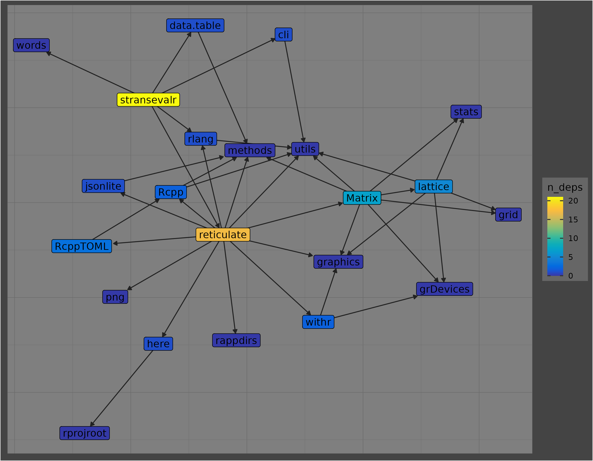

<!-- README.md is generated from README.Rmd. Please edit that file -->

# stransevalr

<!-- badges: start -->
<!-- badges: end -->

The goal of stransevalr is to use `reticulate` to evaluate
question-answer pairs with sentence transformers in R.

## Installation

You can install the development version of stransevalr from
[GitHub](https://github.com/) with:

``` r
# install.packages("remotes")
remotes::install_github("ccb-hms/stransevalr")
```

## Example

I’ve been using these modules on O2:

    module load gcc/9.2.0 R/4.4.0 cmake/3.14.1 cuda/12.1 python/3.10.11

This is a basic example which shows you how to create the virtual
environment with reticulate if needed, then analyze an input
question-answer-response file. This code block will create the virtual
environment for you if it doesn’t exist or set it to be used if it does.
I tried to cut it down as much as possible but these four python
packages have ~50 dependencies which take forever to install :(

``` r
library(reticulate)

# change the virtual environment directory as you like
env_dir = file.path(Sys.getenv("HOME"),
                    ".virtualenvs/sntenv") 

if (dir.exists(env_dir)) {
  
    use_virtualenv(env_dir)
  
} else {
  
    strt = Sys.time()
    
    virtualenv_create(env_dir,
                      python = "/n/app/python/3.10.11.conda/bin/python")
    # ^ If this fails, you probably don't have the python 3.10.11 module loaded
    
    virtualenv_install(env_dir, 
                       packages = c("numpy==1.26.4", "cuda-python==12.1.0", "torch==2.2.2"),
                       pip_options = c("--upgrade", "--force-reinstall"))
    
    virtualenv_install(env_dir, 
                       packages = c("pandas", "sentence_transformers"))
    
    fin = Sys.time()
    
    print(fin - strt)
}
```

`stransevalr` in and of itself is pretty light on the R front outside of
reticulate:



The first column must be named `question`, the second must be `answer`,
and the remaining columns should have names indicating the model they
came from e.g. `llama_70b_rag`:

``` r
library(data.table)
library(stransevalr)

options(datatable.print.trunc.cols = TRUE)

# show input file
system.file("extdata", "correct_fmt.tsv", package = "stransevalr") |> 
  fread() |>
  tibble::as_tibble()
```

    # A tibble: 10 × 4
       question                 answer Response_Azure_Bioc_…¹ Response_Azure_GPT4_…²
       <chr>                    <chr>  <chr>                  <chr>                 
     1 "I am a bit confused ab… "The … "The False Discovery … "FDR, FDR adjusted p-…
     2 "I am working on RNA-Se… "Just… "It seems like you're… "In DESeq2, adding th…
     3 "I am new in this kind … "Ther… "Yes, you're correct … "You're correct that …
     4 "I am testing salmon an… "To a… "The `tximport` funct… "1. ScaledTPM and len…
     5 "In all RNA-seq analysi… "The … "The dispersion param… "In RNA-seq analysis,…
     6 "I know findOverlaps() … "From… "Based on your questi… "It seems like you're…
     7 "I have just downloaded… "I wr… "To map the coordinat… "Mapping genomic coor…
     8 "How can I filter out t… "If y… "Yes, you are on the … "Yes, you are on the …
     9 "I am analysing my RNA-… "You … "The issue you're fac… "It seems like you ar…
    10 "How do I merge a list … "Merg… "You can merge a list… "To merge a list of G…
    # ℹ abbreviated names: ¹Response_Azure_Bioc_RAG, ²Response_Azure_GPT4_Temp0

To run the evaluation you hand the input file to `stransevalr()`:

``` r
input = system.file("extdata", "correct_fmt.tsv", package = "stransevalr")

res = stransevalr(input)

res |> tibble::as_tibble()
```

    # A tibble: 7 × 3
      m                          res              cosine_sims
      <chr>                      <list>           <list>     
    1 Response_Azure_Bioc_RAG    <dbl [10 × 384]> <dbl [10]> 
    2 Response_Azure_GPT4_Temp0  <dbl [10 × 384]> <dbl [10]> 
    3 scrambled_answer           <dbl [10 × 384]> <dbl [10]> 
    4 scrambled_combined_answers <dbl [10 × 384]> <dbl [10]> 
    5 scrabble_match_nword       <dbl [10 × 384]> <dbl [10]> 
    6 scrabble_match_nchar       <dbl [10 × 384]> <dbl [10]> 
    7 reembed_ground_truth       <dbl [10 × 384]> <dbl [10]> 

There are functions for creating the bar and dot/boxplots as well:

``` r

p1 = plot_cos_sim_bars(res)
p2 = plot_cos_sim_boxes(res)

ggsave(p1, filename = "~/p1.png", w = 9, h = 7)
ggsave(p2, filename = "~/p2.png", w = 9, h = 7)
```
